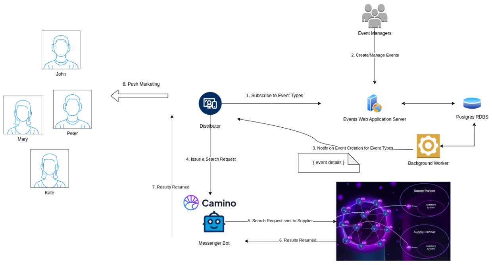

# CaminoHackathonApi

# Reference Architecture Diagram



# This repository

It implements the Distributor Plugin which listens for new
Events coming in from Events Service. 

For the Events Service implementation [go here](https://github.com/pmatsinopoulos/events_service).

# Steps to run

1. Unzip the [publish.zip](./publish.zip).
2. Install and start the distributor Camino Messenger bot on port 9090. [Installation Instructions](https://docs.camino.network/camino-messenger/bot/installation).
3. Run the following command in a terminal
  ```bash
  CaminoHackathonApi 8081
  ```
  Note: You can use any port that is available on your machine.
  
4. You need to have [ngrok](https://ngrok.com/) installed and ready to run.
5. Run ngrok as `ngrok http 8081` and get the `https://....` given as output.
6. Go to [Events Service](https://events-service-voja.onrender.com/) and create a subscription for your distributor service. The URL call back should be `https://....<ngrok address.../Events`.
7. Then create an event [here](https://events-service-voja.onrender.com/events/new).
8. You will see the search results appearing at the terminal output where you have `CaminoHackathonApi` running.

